# Google Data Analytics Capstone Project

I completed Google Data Analytics Professional Certificate and as a final project I chose to analyze bike-share company named 
Cyclistic.

For this project, I used R for preparation, cleaning, analyzing and visualizing the data.

## Background

Cyclistic is a bike-share program that features more than 5,800 bicycles and 600
docking stations.The bikes can be unlocked from one station and returned to any other station
in the system anytime.

Until now, Cyclistic’s marketing strategy relied on building general awareness and appealing to
broad consumer segments. One approach that helped make these things possible was the
flexibility of its pricing plans: single-ride passes, full-day passes, and annual memberships.
Customers who purchase single-ride or full-day passes are referred to as casual riders.
Customers who purchase annual memberships are Cyclistic members.

Cyclistic’s finance analysts have concluded that annual members are much more profitable
than casual riders. Although the pricing flexibility helps Cyclistic attract more customers,
the company believes that maximizing the number of annual members will be key to future growth.
Rather than creating a marketing campaign that targets all-new customers, the company believes
there is a solid opportunity to convert casual riders into members.

The goal is designing marketing strategies aimed at converting casual riders into
annual members. In order to do that, however, there is a need to better understand how
annual members and casual riders differ, why casual riders would buy a membership, and how
digital media could affect their marketing tactics.

## Goal of the project

Analyzing the data to see how do annual members and casual riders use Cyclistic bikes differently.

## Steps and Deliverables

### A clear statement of the business task - ASK Phase

The primary objective of this analysis is to examine and compare the usage patterns of casual riders and annual members of Cyclistic bikes. By identifying the key differences in their riding behaviors, preferences, and usage trends, we aim to provide actionable insights that the marketing team can leverage to design effective strategies for converting casual riders into annual members, ultimately enhancing customer retention and driving revenue growth for Cyclistic.

### A description of all data sources used - PREPARE Phase

There is 12 .csv files that includes Cyclistic's previous year data. Here is the image of the R script that shows how I uploaded them:

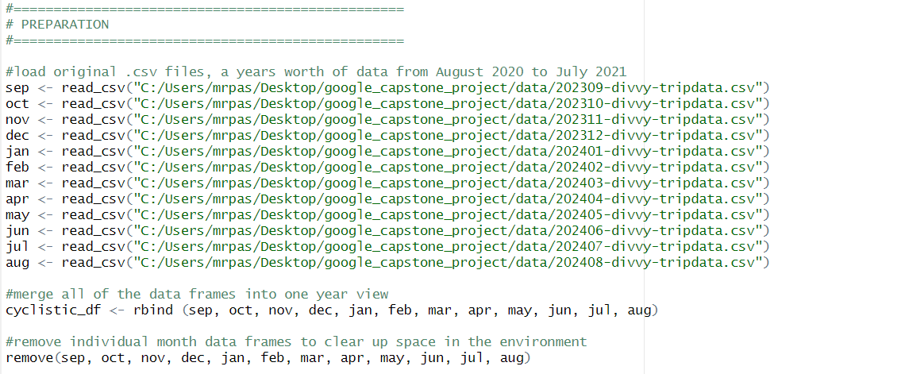

In this step, I loaded the 12 .csv files and then combined them into a single file in order to easier and more efficient analyzing. After that, removed the 12 separate files as we didn't need them anymore.
  

### Documentation of any cleaning or manipulation of data - PROCESS Phase

Here is the image of the R script that shows the codes of cleaning the data:

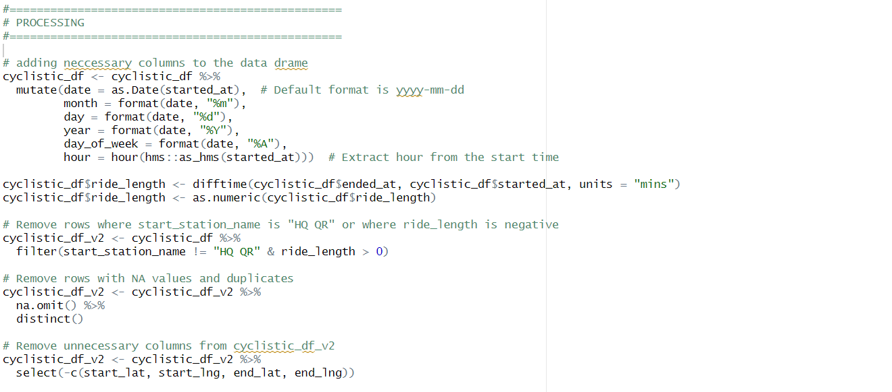

In this step, first I added new columns that we need for analyzing. "date" column for standart date format of the riding, "month" - "day" - "year" columns for holding them separately, "day_of_week" column for the name of the days and "hour" column for the time of ridings. All based on "started_at" column of the original data frame.

Second, I added "ride_length" column as minutes and converted it to numeric variable.

After adding neccessary columns, I cleaned the data by removing "bad" data, dublicates and columns that we don't need for analyzing.

### A summary of the analysis - ANALYZE Phase

Here is the image of the R script that shows the codes of analyzing the data:

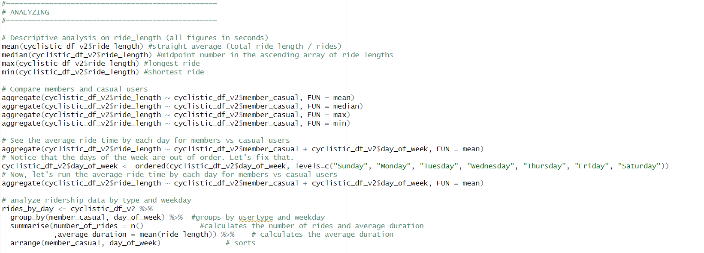
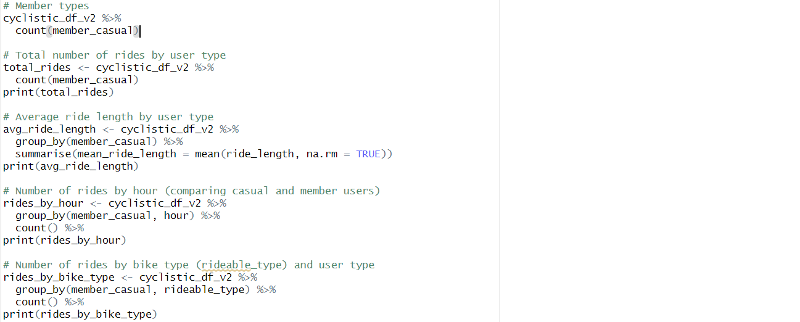

On the first two steps I calculated mean, median, max and min values of the ride length and then found these values for both member types in order to compare them.

Then, analyzed the average ride time for members and casual users by each day of the week. Right after that, the part of the code does the same thing but also it shows the number of rides of the user types by the day of the week and create a table for that.

Next, to see how the number of rides and average ride lenght differs by members, analyzed them separately.

Finally, to see if there is significant difference between number of the rides of members by hour and by bike type, I compared it.

### Supporting visualizations and key findings - VISUALIZATION Phase

Here is the image of the R script that shows the codes of visualizing the data:

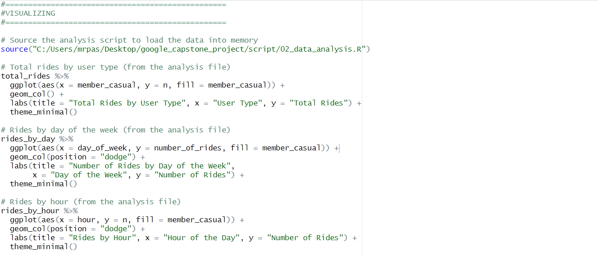
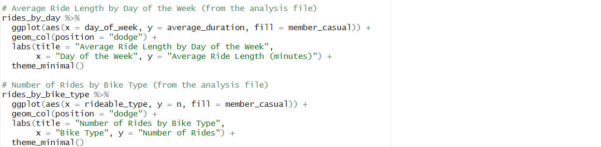

First I uploaded the analysis script to visualization script because I wrote the codes separately for preparation, analyzing and visualization.

For the first viz, I created a graph for the total rides by user type.

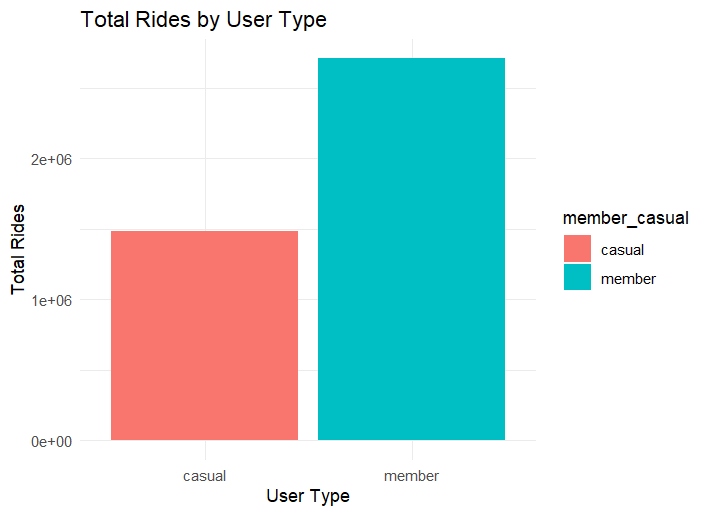

As we can see, the members are almost twice as much casuals.

Then I looked at if there is a significant difference with number of rides between members by day.

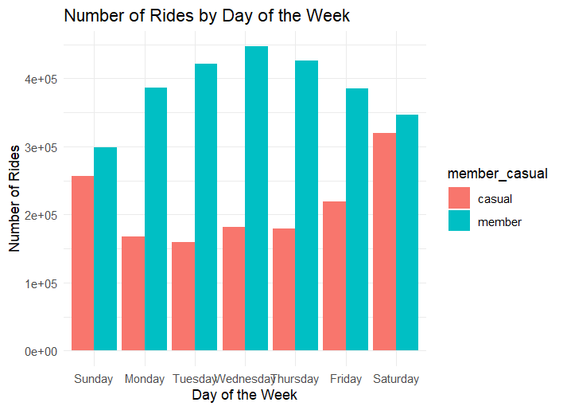

And I notices that although there are always more casual members, the difference narrows significantly on weekends. 

Next, lets look at the comparison of the number of rides by hours.

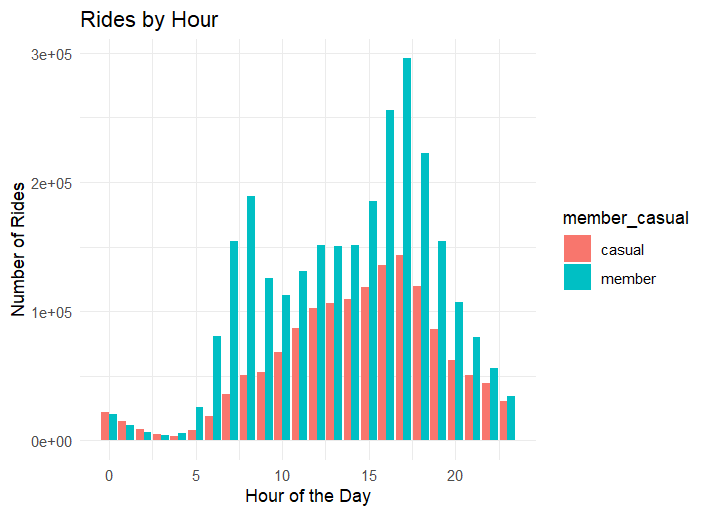

The difference between the members decreasing by middle of the day and night hours, we draw this conclusion from here.

After that, we see the average ride length comparison between members by day, below.

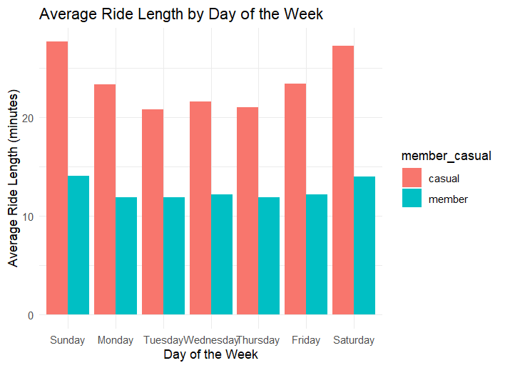

Significantly, casual members' riding time is more than the members, twice as much almost always. Since we know the number of the rides of the casuals always, especially on weekdays, less than members, this is an interesting insight. We can tell that riding time of the casuals way much more than casuals.

Last, we see below the comparision of the members by bike type. There is important difference with classis bike between them.

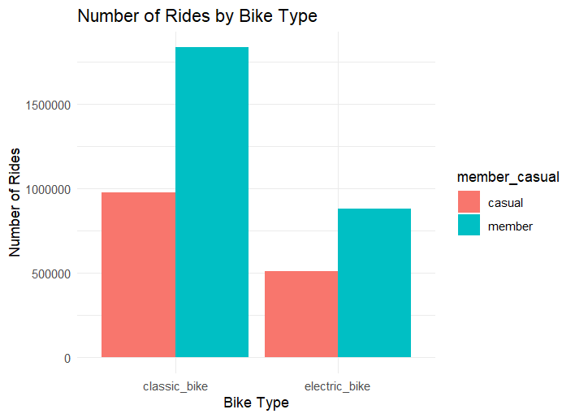

### Insights

Based on the analysis, the most significant insights are:

1. Casual riders tend to have longer ride durations compared to annual members, often nearly double in length.

2. Annual members consistently take more rides, particularly on weekdays, whereas casual riders show increased activity on weekends, narrowing the gap between the two groups.

3. Ride patterns vary by time of day, with casual riders more active during midday hours and members showing a more even distribution throughout the day.

### Three recommendations based on your analysis - ACT Phase

1. Weekend Promotions: Since casual riders tend to use the service more during weekends, creating membership promotions or discounts specifically for weekends could encourage them to become annual members.

2. Incentivize Long Rides: Casual riders generally have longer ride durations than members. Offering incentives, like discounts on long rides for members, could convert these casual users into loyal annual members.

3. Targeted Marketing for Midday Usage: Casual riders often ride more in the middle of the day. Running membership campaigns during these hours could attract casual users to subscribe.

> I used R and RStudio for all process and here is the libraries I used:

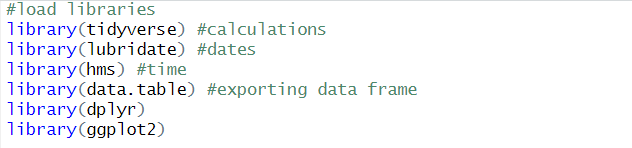
